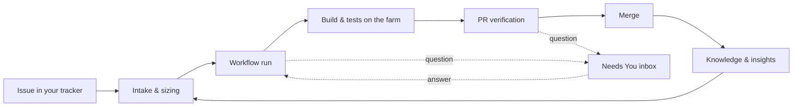

Before you meet a screen you meet a vocabulary: loop, run, workflow, gate, decision, pool,
workspace. This page puts those words in the order the work happens, so the rest of the
guide reads as one story. Each term is also in the [Glossary](./glossary.mdx).

## Your workspace

Everything you see belongs to one **workspace** — your team's tenancy, with its members,
repositories, ticket sources, policies and build farm. The header's workspace chip shows
which one you are in and which repository you are looking at (`acme-robotics / All repos`,
for example); you switch between them there. Your **role** in the workspace decides what
you may change: some controls appear only to owners and admins.

## The loop, from issue to merged pull request

Ouroboros is named for the snake that eats its own tail: the work is a **loop**, and what
one loop learns feeds the next.

1. **An issue arrives.** Issues come from the **ticket sources** your workspace connects —
   a GitHub repository, for example. They appear on the [Issues](./issues.mdx) screen.
2. **Intake and sizing.** Ouroboros reads each issue and estimates its effort on a T-shirt
   scale (XS to XL). You choose a **workflow** for it (**Assign workflow**) and queue it
   (**Queue → *workflow***). [Planning](./planning.mdx) can draft new tickets from a
   paragraph of prose.
3. **A run starts.** A queued issue becomes a **run** — one pass of the loop, numbered
   **Loop #*N*** — the moment it is picked up. The run follows the workflow's **stages**
   in order (analyze, plan, implement, build, test, self-review, …), and each stage that
   needs a model is routed to the one your [model routing](./models.mdx) assigns to that
   kind of work.
4. **Build and test on the farm.** The change is built and tested on your **build farm**:
   **runners** you enroll on your own hardware, grouped into **pools**. A failing build or
   test sends the loop back to an earlier stage to try again, up to the workflow's limit.
5. **PR verification.** The loop opens a pull request, and its verification page checks
   it against **verification gates** — build, tests, scans, review — and an **acceptance
   criteria** matrix that asks: does the PR do what the issue says? **Evidence** backs
   each criterion.
6. **Merge.** When every gate is green and your policies allow it, the pull request
   merges. Otherwise it waits for a person.
7. **The loop learns.** What the run taught it becomes [Knowledge](./knowledge.mdx) —
   learned facts you confirm or reject — and [Insights](./insights.mdx) and the
   [Build Analyzer](./analyzer.mdx) show where loops spend their time and where they still
   need people. The next issue is worked with all of it.

You follow every live loop from the [Mission Control dashboard](./dashboard.mdx); open one
and you are in its [run console](./runs/console.mdx) — the stage timeline, the agent's
transcript, the changes so far, the resources it has used and the guardrails it is held to.

<Screenshot id="user-guide.concepts.loop-in-app" />

## Where you decide

A loop runs on its own until it reaches a decision that is yours. Then it stops and asks.

- **The Needs You inbox.** Every question a loop is blocked on becomes a **decision** card
  in [Needs You](./inbox.mdx) — the sidebar entry with a count beside it. Approving a
  merge, allowing a one-time change to a protected path (**Allow once** or **Deny**),
  signing off a plan, confirming a learned fact, retrying a run that needs a human, or
  approving extra spend: you answer on the card, and the loop resumes. A decision can wait
  — **Snooze** it for an hour, four hours or a day.
- **Pull request verification.** On a pull request's verification page you can approve
  or decline the **Human approval** gate, add or waive acceptance criteria, and **Arm the
  merge** or merge it yourself. See [Pull requests](./pull-requests.mdx).
- **The run console.** While a loop runs, owners and admins can **Pause loop**, **Take
  over in IDE** to finish the work by hand, or **Abort run**; any member who is not a
  viewer can **Steer the loop** with a note. See [the run console](./runs/console.mdx).
- **Policies.** How much a loop may do without you is set by your workspace's
  **Autonomy policies** — for example **Auto-merge when all gates green**, **Human review
  required** and **Protected paths need allow-once** — under
  <UiPath path="Settings > Policies" />. Owners and admins edit them.

## Dry-run and live

Ouroboros can work an issue end to end without anything merging. There are two separate
things called "dry run", and a third you may meet on the run console.

**The dry-run policy** is a workspace setting under <UiPath path="Settings > Policies" />.
While it is **On**, loops run for real — models are called, the farm builds and tests,
pull requests open — but every pull request opens as a **draft** and **nothing merges**,
even through a workflow that is set to auto-merge. On a pull request's page the merge
control reads **Dry-run — review the draft PR**. Completing the Get Started wizard turns
dry-run on, so a new workspace starts safe; an owner or admin turns it off
(**Turn dry-run off**) when you trust the loop to merge. With dry-run off, a loop is
**live**: a pull request that passes its gates and your policies merges without a person.
The **Dry-run mode for new repos** policy does the same for each new repository's first
loops only.

**A dry run of a workflow** is a rehearsal in the Workflow Studio: you pick a sized
issue, choose **Run dry run**, and see which path the workflow would take. No model is
called, nothing runs and nothing is recorded. See
[Workflows](./workflows/studio.mdx).

**A simulated run** is marked with a **Simulated run** banner on the run console. It was
opened by Ouroboros' simulated-run driver, not by a real loop: no executor, repository or
model did the work it shows. The screenshot above is one, from the demonstration data.

## What can go wrong

- **A loop stops and waits.** It is almost always a decision in [Needs You](./inbox.mdx);
  the header's **Needs you** count tells you how many are waiting.
- **A loop keeps returning to an earlier stage.** A build or test is failing; the stage
  timeline shows the attempt count, and [test results](./runs/tests.mdx) show why.
- **A pull request opened but never merged.** Check whether dry-run is on, and which
  verification gate is not green.
- **You cannot find a control.** Some actions — pausing a loop, changing a policy — are
  for owners and admins only.
